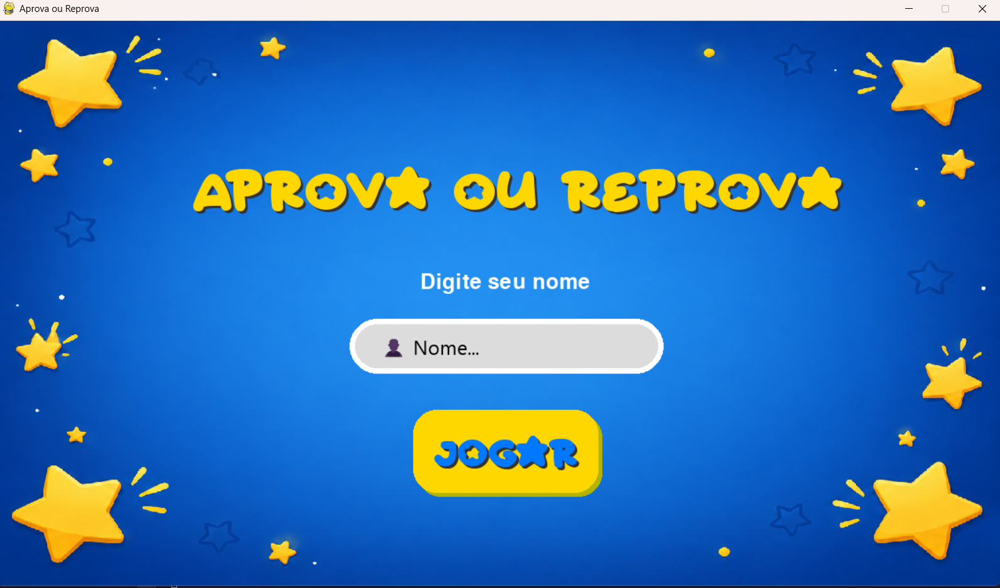
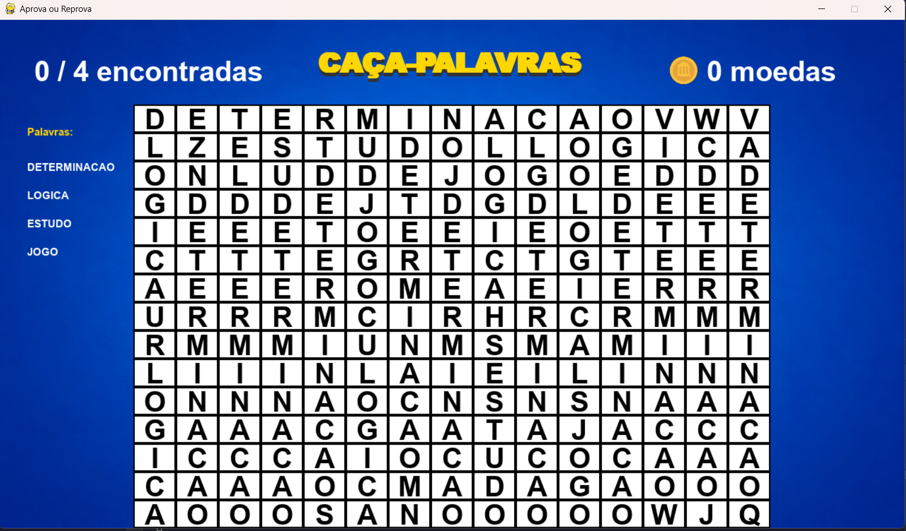
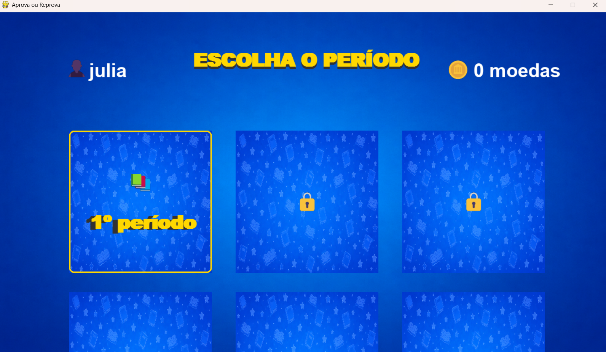
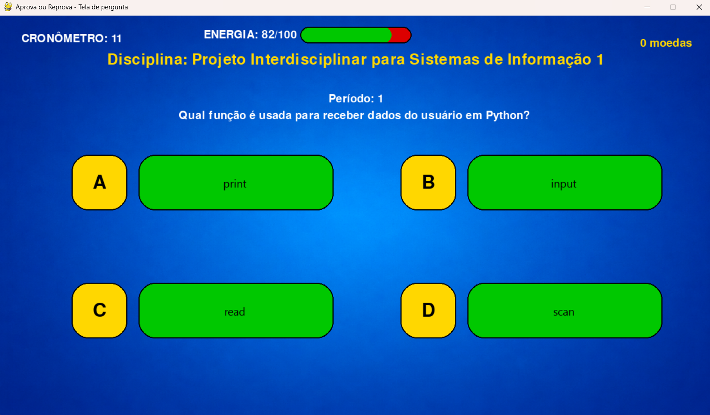
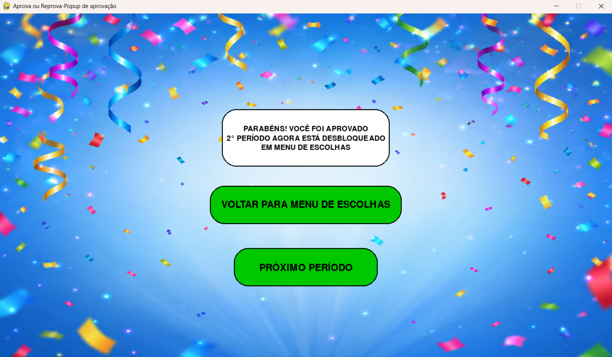
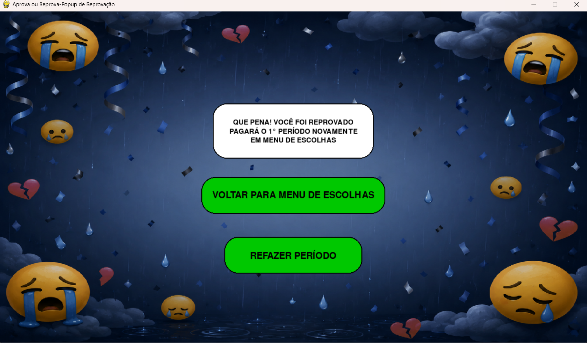

# 🎓 Simulador BSI - Jogo de Progressão de Períodos

## 📖 Descrição do Projeto

O **Simulador BSI** é um jogo desenvolvido em Python que simula a trajetória de um estudante do curso de **Bacharelado em Sistemas de Informação (BSI)** ao longo dos períodos da graduação.

Durante a partida, o jogador avança pelos períodos do curso realizando caça-palavra e respondendo perguntas relacionadas às áreas de conhecimento presentes na matriz curricular de BSI, como Programação, Banco de Dados, Matemática e Lógica, Infraestrutura, Gestão e Sistemas de Informação.

Cada disciplina está associada a uma categoria de perguntas. Ao cursar uma disciplina, o jogador deve responder uma questão sorteada da área correspondente. Caso erre, a disciplina se torna uma pendência que deverá ser paga posteriormente. O objetivo é concluir todos os períodos, quitar possíveis pendências e, ao final do curso, receber um certificado de conclusão.

---

## 🎯 Objetivos do Jogo

* Simular a progressão acadêmica de um estudante de BSI.
* Reforçar conhecimentos básicos das áreas do curso.
* Trabalhar conceitos de lógica, programação e estruturas de dados.
* Demonstrar modularização e organização de software em Python.

---

## ⚙️ Funcionalidades

* Cadastro do nome do jogador.
* Progressão pelos períodos do curso.
* Completar o minigame de caça-palavras
* Sorteio de perguntas por categoria.
* Controle da energia do jogador ao responder as perguntas
* Cronômetro para o jogador responder o mais rápido possível
* Sistema de aprovação e reprovação.
* Controle de disciplinas pendentes.
* Possibilidade de pagar pendências em períodos posteriores.
* Sistema de jubilamento após múltiplas reprovações.

---

## Exemplos de Execução

### Início do Jogo



### Minigame



### Tela de escolha do período



### Tela de disciplinas



### Aprovado



### Reprovado



---

## 🗂️ Estrutura do Projeto

```text
Aprova ou Reprova---JOGO-DE-PP
│JogoPP
└── Simulador-BSI
    ├── .gitignore
    ├── classes
    │   ├── disciplina.py
    │   ├── jogador.py
    │   ├── pergunta.py
    │   └── __pycache__
    │       ├── disciplina.cpython-313.pyc
    │       ├── jogador.cpython-313.pyc
    │       └── pergunta.cpython-313.pyc
    ├── data
    │   ├── disciplina.json
    │   ├── pergunta.json
    │   └── tcc.json
    ├── fontes
    │   └── Starborn.ttf
    ├── imagens
    │   ├── fundo_aprovado.png
    │   ├── fundo_jogo.png
    │   ├── fundo_periodos.png
    │   ├── fundo_reprovado.png
    │   └── fundo_tela_inicial.png
    ├── imagens_readme
    │   ├── disciplinas.png
    │   ├── fazendo_tcc.png
    │   ├── minigame.png
    │   ├── pergunta.png
    │   ├── tela_pergunta.png
    │   ├── tela_aprovado.png
    │   ├── tela_escolha.png
    │   ├── tela_inicial.png
    │   ├── tela_inicial_design.png
    │   └── tela_reprovacao.png
    ├── interface
    │   ├── constantes.py
    │   ├── minigame.py
    │   ├── popup.py
    │   ├── tela_escolha.py
    │   ├── tela_inicial.py
    │   ├── tela_pergunta.py
    │   └── __pycache__
    │       ├── constantes.cpython-313.pyc
    │       ├── menu_inicial.cpython-313.pyc
    │       ├── minigame.cpython-313.pyc
    │       ├── popup.cpython-313.pyc
    │       ├── tela_escolha.cpython-313.pyc
    │       ├── tela_inicial.cpython-313.pyc
    │       └── tela_pergunta.cpython-313.pyc
    ├── main.py
    ├── README.md
    ├── sistema
    │   ├── jogo.py
    │   ├── utils.py
    │   └── __pycache__
    │       ├── jogo.cpython-313.pyc
    │       └── utils.cpython-313.pyc
    └── __pycache__
        ├── disciplina.cpython-313.pyc
        ├── jogador.cpython-313.pyc
        ├── jogo.cpython-313.pyc
        ├── pergunta.cpython-313.pyc
        └── utils.cpython-313.pyc
```

### Responsabilidade dos módulos

* **main.py** → Inicialização do jogo.
* **jogo.py** → Controle do fluxo principal da partida.
* **jogador.py** → Classe responsável pelos dados do jogador.
* **disciplina.py** → Classe que representa as disciplinas do curso.
* **pergunta.py** → Classe responsável pelas perguntas e validação das respostas.
* **utils.py** → Funções auxiliares para carregamento de dados e utilidades gerais.
* **data/** → Armazena os arquivos JSON contendo disciplinas e perguntas.
* **interface/** → Armazena a interface e funcionalidades das telas.

---

## 🛠️ Tecnologias Utilizadas

* Python 3
* JSON
* Programação Orientada a Objetos (POO)
* Colorama
* Pygame
* Interface
---

## Funcionalidades da 2° Release

* Caça-palavras
* Cronômetro
* Barra de energia
* Sistema de moedas
* Integração ao pygame
---

## 🚀 Como Executar

1. Clone o repositório:

```bash
git clone https://github.com/GuilhermeValois/Simulador-BSI---Jogo-de-PP.git
```

2. Entre na pasta do projeto:

```bash
cd Simulador-BSI---Jogo-de-PP
```

3. Instale a dependência necessária:

```bash
pip install colorama
```

4. Execute o programa:

```bash
python main.py
```

---

## 📦 Dependências

O projeto utiliza a biblioteca **Colorama** para exibir mensagens coloridas no terminal, tornando a interação com o jogador mais intuitiva e agradável.

Caso a biblioteca não esteja instalada em sua máquina, utilize o comando:

```bash
pip install colorama
```

---

## 📂 Documentação e materiais:

- Relatório (Guilherme Vasconcellos Valois):
  [Link do Docs](https://docs.google.com/document/d/1poZHwngC5yi5qpTBt2vC4iwKmihuQIfDIJDbY6v9ZLM/edit?usp=sharing)

- Vídeo (Júlia Galindo de Carvalho Cardoso):
  [Link do vídeo](https://youtu.be/o1qojXAslC4)

---

## 👨‍💻 Autores

* Guilherme Vasconcellos
* Julia Galindo

---

## 📌 Repositório

https://github.com/GuilhermeValois/Simulador-BSI---Jogo-de-PP

